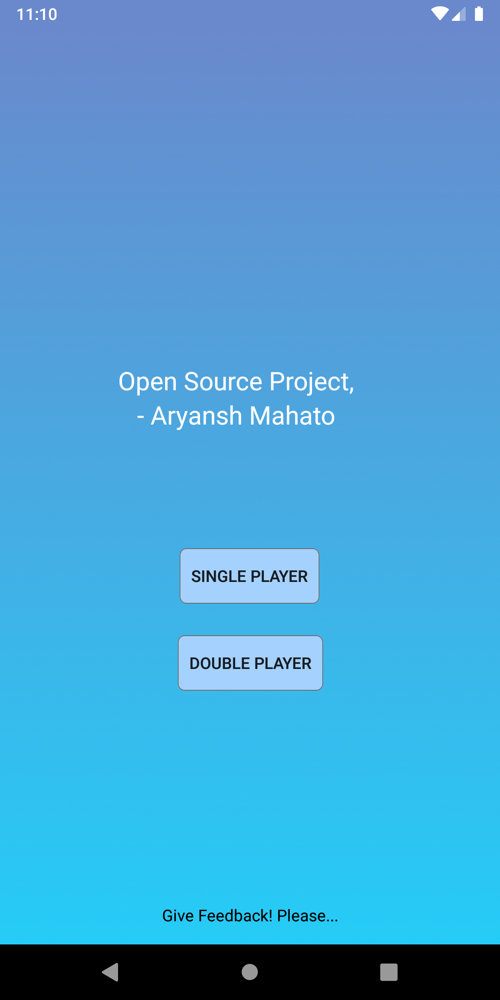
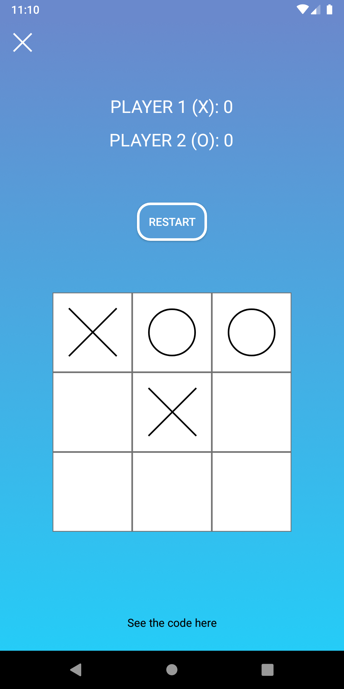
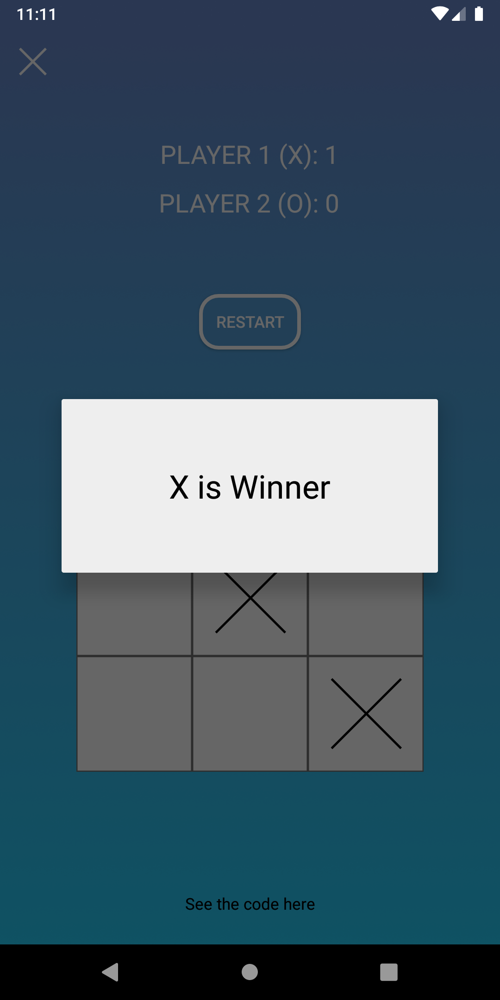
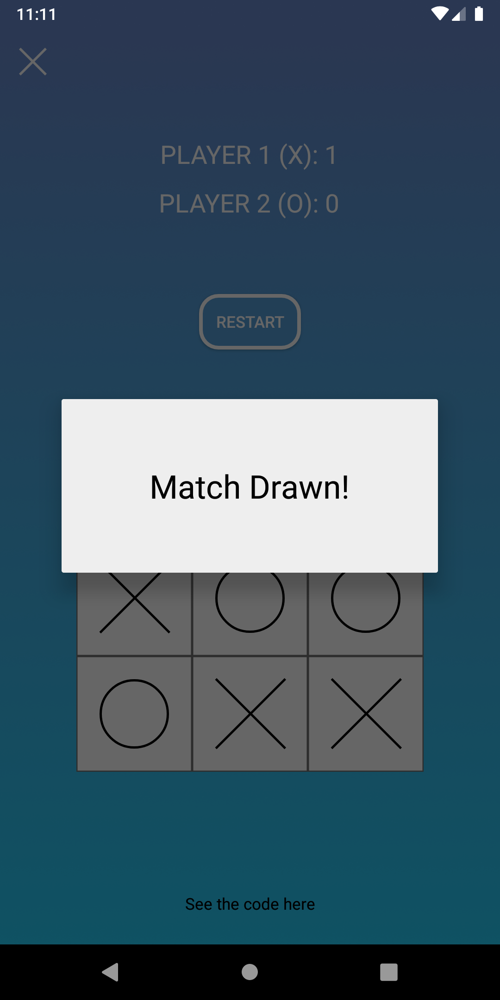

# Tic Tac Toe
A simple Two Player Tic Tac Toe game.
It's a simple frontend Tic Tac Toe game with no implementation of One vs CPU algorithms
 
 

### Thing Implemented
* Single and Dual Player Choice
* Winning algorithm(How the player win this game)
* Draw Algoritm

 
 

### Some ScreenShots

 
 

### How to use
1. Clone or Download the repository
2. Open your Android Studio(3.5 or 3.5+)
3. Go to File and import/Open
4. You are good to go.. Best of Luck!

 
 

If You liked my Project then please star the repository.
